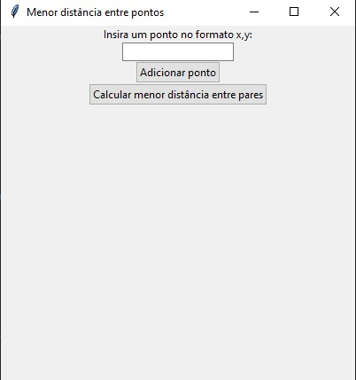
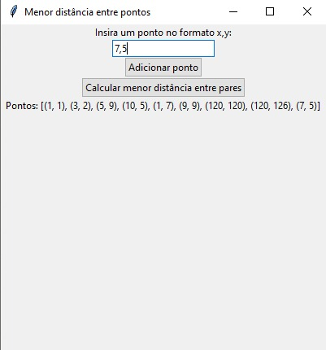
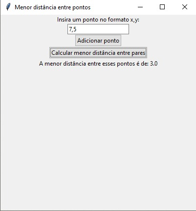

Temas:
 - D&C
 
# Menor Distancia entre pontos

**Número da Lista**: 44<br>
**Conteúdo da Disciplina**: Algoritmos de dividir e conquistar<br>

## Alunos
|Matrícula | Aluno |
| -- | -- |
| 19/0042303  |  Carlos Daniel de Godoy Barros Nascimento |
| 18/0121847  |  Helder Lourenço de Abreu Marques |

## Sobre 
Desejamos encontrar a menor distância entre diversos pontos distintos usando mediana de mediana e distancia euclidiana.

## Screenshots




## Instalação 
**Linguagem**: Python<br>

Para executar o projeto é necessario instalar a biblioteca "tkinter" com o seguinte comando

```bash 
pip install tk
```
caso haja problemas siga o seguinte tutorial:

<a href="https://www.tutorialspoint.com/how-to-install-tkinter-in-python" target=_blank>Installing Tkinter</a></h3>
## Uso 
Apos a instalação das bibliotecas executar o seguinte comando na raiz do projeto:

```bash 
python3 main.py
```
## Link do vídeo no youtube
https://youtu.be/POkQYqxgnOw
